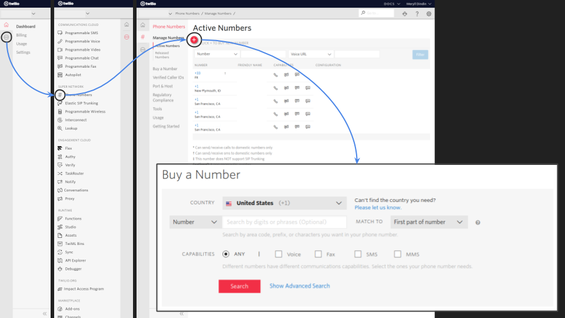
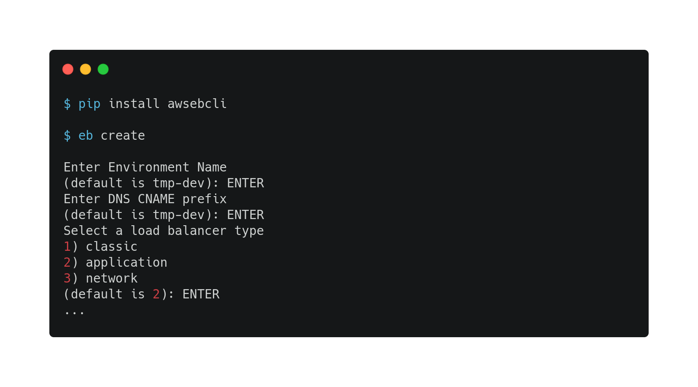
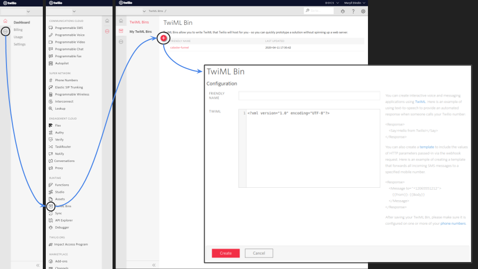
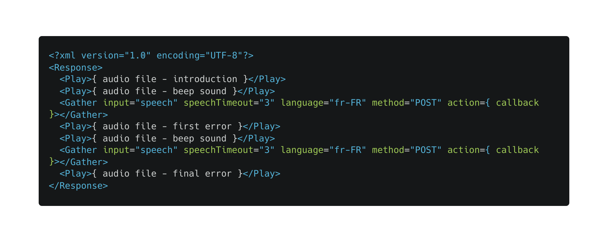
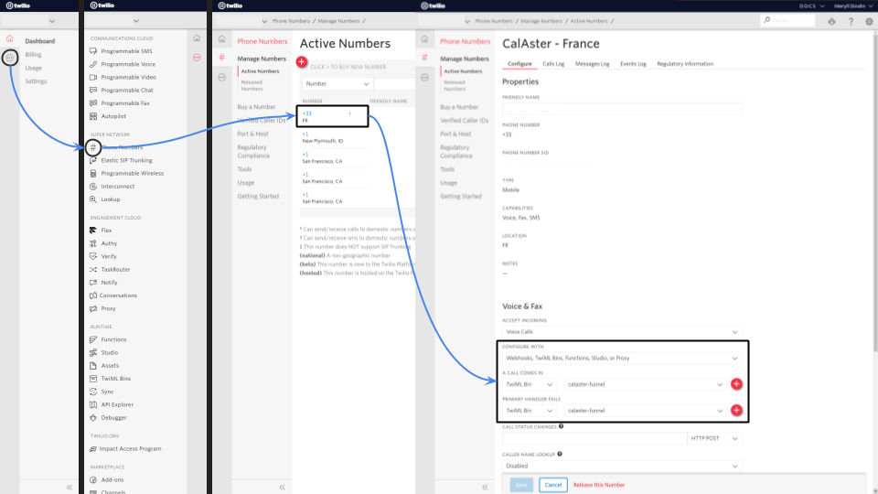

`Author: Meryll Dindin`

# Build Scalable Interactive Voice Response with Twilio, AWS and Python

During crisis situations such as the current COVID-19 pandemic, call centers are overwhelmed and lack the human resources to deal with the sudden uptick in calls. However, new technology is available to build scalable filters that help avoid saturation. One possibility, IVR (Interactive Voice Response) systems that react to both voice or typed digits. In the case of COVID-19, life-threatening calls could be diverted to medical services, COVID questions redirected to green numbers setup by the government, and symptom checks partially automated and sent to medical students. This **repository** is covering the exact purpose of building an IVR with Twilio, AWS and Python.

## Set up your dev environment:

```bash
git clone https://github.com/cal-aster/funnel.git
virtualenv -p python3 funnel
cd funnel
source bin/activate
pip install -r requirements.txt
```

## Buy a phone number on Twilio:

Once your accounts are set up, the first step on your quest to build this IVR is to purchase a phone number. Twilio made it pretty straightforward to get one, independently from the country you live in. Some countries have different regulations though, and purchasing a number in France requires more paperwork than purchasing a phone number in the United States. Nonetheless, go through the process and you will be equipped with a brand new phone number in the matter of a few clicks.



## Record your voice and upload it on a public S3 bucket:

The last requirement is to build an S3 bucket on AWS with public access enabled. To do so, you simply need to log in the AWS console, look for the s3 service (or skip to the console here), and click on ‘create bucket’. Once redirected to the creation wizard, you can give it a fancy name, define its region of availability (it will be available anywhere, this is more of a latency optimization problem), and its public/private settings. 

## Launch your Python Flask application:

At the macro level, we are looking for a responsive endpoint that tells our TwiML Bin what to do depending on the input provided by our user. Meanwhile, let’s keep in mind that this response, as specified by Twilio, has to respect the initial TwiML Bin XML formatting.

### Dockerize your application:

```bash
docker build -t funnel .
docker run -it -p 5000:5000 --env-file=config-docker.env funnel
```

### Push your application to the cloud:

Having an application that runs locally is great, but having it hosted on the cloud is a whole different story. My usual go-to is AWS Elastic Beanstalk, which makes it super convenient to run python applications on the cloud. (You can read more about creating Elastic Beanstalk applications directly through [AWS](https://docs.aws.amazon.com/elasticbeanstalk/latest/dg/eb3-create.html) or another [article of mine](https://towardsdatascience.com/from-dev-to-prod-all-you-need-to-know-to-get-your-flask-application-running-on-aws-ecedd4eec55?source=friends_link&sk=ac5c1051838100d43494e6b9eb8f85fe).) 

* Option 1: Default Elastic Beanstalk container:



* Option 2: Config files based creation:

Make sure to first rename `.os-ebextensions` into `.ebextensions`, and `.os-elasticbeanstalk` into `.elasticbeanstalk`. Once your AWS EB CLI is configured, and the config files filled, you simply have to run the following:

```bash
eb create FUNNEL --instance_type 't3.micro' --elb-type 'classic' --min-instances '1' --max-instances '4' --region 'eu-west-3' --timeout '5' --envvars FLASK_TIMEZONE='Europe/Paris',FLASK_SECRET_KEY='xxx'
```

Files that require your input:
* `.ebextensions/listeners.config` - Only allows HTTPS over 443
* `.ebextensions/security.config` - Set up subnets and VPC configurations
* `.ebextensions/timezone.config` - Pick your server timezone
* `.elasticbeanstalk/config.yml` - General project configuration

## Configure your Twilio phone number:

### Create a TwiML Bin:

Interactivity, further, assumes user input and a corresponding output. There are multiple ways of doing that, but in this post we’ll lean towards the simple and powerful – TwiML Bins. Practically, a TwiML Bin consists of XML depicting if-else decision trees in a language called TwiML. Among the possible interactions, you can ‘Say’ a batch of words, ‘Gather’ user inputs (either voice or DTMF), or even ‘Play’ audio files – among many other possibilities. In our IVR, we will set up a TwiML Bin that will take advantage of that functionality.



Example of template we used for *Funnel*:



### Connect your TwiML to your phone number:

This next step is done on Twilio: update the configuration of our recently acquired phone number. By following the steps presented below (or, alternatively, start from the Phone Numbers console), we redirect the voice calls towards the TwiML Bin that we configured above.



## Read more:

* [CalAster](https://project-aster.com)
* [Funnel](https://hackcovid19.bemyapp.com/#/projects/5e9157ab379d81001b81933e)